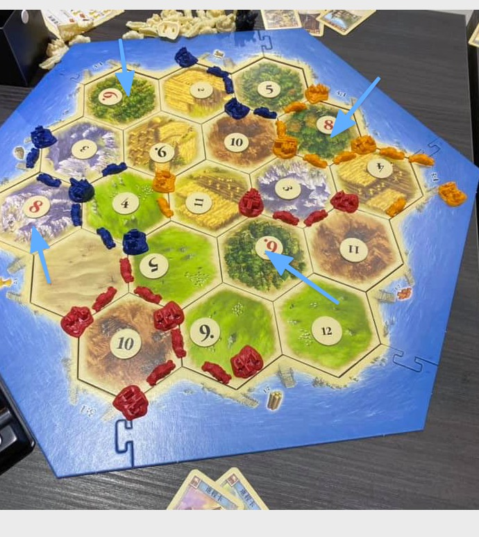

# 第二章  你的升級卡頓點在哪裡？

看人家打桌游是非常有趣的事，有時候你在旁邊圍觀，總會覺得場內這些玩家怎麼笨？怎麼不這麼這麼做就好了。

但事實上看人家玩是一回事，實際下去玩又是一回事。

玩桌游時，下場之前會想著我應該如何如何打出最佳戰略，但是戰情一緊張，加上每一桌玩家的風格都不一樣。有時候你被場上的玩家影響，又或者是出於安全考量，只能下自己覺得最穩妥的決策。

我們知道要升級自己的演算法，但是事實上卻做不到，其實也是類似的原因。

在這些桌游故事裡面。你會發現幾個特徵：

1. 每個人的決策大多是基於過去經驗，本能下出的決策
2. 每個人被周遭的環境影響很大，不同的地域會產生不同的決策性格
3. 每個人被場上同桌的玩家影響很大，在某些桌有人顯著的領先，其他人會不管自己的原先優勢，三七二十一就開始拷貝他人戰略，最後卻自亂陣腳。

那麼，最大的問題在哪裡？

## 一、我們到底要升級什麼？談談價值觀

我想談談另外一款桌遊：「卡坦島」，這盒是開啟我桌遊人生的啟蒙遊戲，是一款策略遊戲。

主要核心玩法是佔地生資源，蓋建築，每個玩家以不同策略得分，誰先取得最後的 10 分者贏。

我喜歡卡坦島的主要原因，是因為卡坦島是一個考驗判斷機率、策略佈局、口頭交涉，最後還有一點靠運氣成分的經典遊戲。而且這個遊戲我認為其實跟人生與創業很像。

遊戲主要的玩法是，卡坦島上生產了五種資源，分別是：麥、礦、木、磚、羊。

而這五種地形是隨機分布的。遊戲一開始，玩家必需要佔據兩個資源的交界點作為最初基地，開始生產資源。而每塊地形上又有數字，每個玩家進行動作前，必須先擲兩顆骰子，骰到哪個點數，交界點的基地就可以取得資源。

因為骰子是有概率的，一般來說兩個骰子組合：概率出現的大小順序是 7 > 8=6 > 9= 5> 10 = 4> 11 =3 > 12 = 2。

遊戲裡面，3礦2麥可以蓋城堡。木磚麥羊可以蓋房子。木磚蓋路。麥礦羊可以抽發展卡。

交界點上若蓋了房子拿1分。蓋了城堡拿2分（資源也可以拿雙份）。

數字是一開始擺盤時就決定好的。所以一開始玩家得觀察場上資源地形，心中計算概率分佈。再決定自己起始機率。

但是，因為一個交界點只能放一個基地。放置基地又有先後順序，所以即便你在心中已經算出哪個點會生很多資源，實際下子時你也未必排得到。只能選擇次好的資源點作為機基地。

而你選擇的居住地，會選擇了你的打法。

遊戲結束是 10 分。一開始大家只有 2 分。房子x1，城堡 x 2。但遊戲裡面還有其他方式湊分。

比如說你可以抽發展卡，翻出三張騎士拿軍王，有2分。或者是在遊戲裡面蓋出最長的路有2分。又或者是抽發展卡，發展卡一疊25張裡面有5張1分卡。

不管是什麼戰略，哪位玩家先取得 10 分誰就得勝。

### 考驗策略佈局

雖然每個玩家都可以在心中計算最佳位置。但是自己不一定拿得到。又或者是本場某些資源極度缺乏，那麼以基礎建設的打法可能失效。最佳點也未必是紅色 6,8 點的交界。所以必須臨機改變策略。

而且，因為這個遊戲裡面。是四個人分享一塊大陸。遊戲裡面，不可能每個人都能自己自足。想要發展，多半要面臨到拿自己手上的資源，去交換自己缺少的資源，才組得出想要的基地建設。

玩家可以選擇以 4:1 的比例與銀行交換。但是，如果玩家的勢力範圍內，有成功蓋起三一港，就可以以 4:1 的比例與銀行交換。又或者，勢力範圍裡面有某種資源的特殊二一港，就能以該種資源與銀行進行 2:1 交換。

有的玩家，在牌局一開始，會計算出本場資源可能失衡。有時候就會去賭一下二一港，打快戰。

### 考驗交設計巧

然而，資源交換，也未必需要以這麼懸殊的比率與銀行作交易。你也可以跟場上的玩家交換。但這就很講究個人交涉能力。因為別的玩家未必想跟你交換。交涉能力也不限於勸說別人與你交換資源。你甚至可以勸說 A 不要跟 B 換。

遊戲裡面還有另外一個有趣的機制，擲到 7（兩顆骰子最容易出現的組合）會出現強盜。擲 7 的玩家可以移動強盜旗子，強行佔領某塊地形版圖。而有強盜壓制的版圖，在強盜離開之前，資源產出為 0 。不僅如此，擲 7 的玩家，在進行第一次移動時，還可以搶劫在此版圖上有勢力一份資源。

所以，與強盜談判不要搶自己而去搶他人也是一個功力。

### 千人千面，每個人都有不同策略

我非常喜歡這個遊戲。而且這個遊戲也是桌遊世界裡面最經典的遊戲。是因為這個遊戲沒有必勝的策略。一千個人來打有一千種不同的玩法戰略。

因為這個遊戲：第一是要看機率佈局，第二要看場上資源分布，再決定自己資源佈局。第三是靠談判功力交易資源。

遊戲建設路線通常是先蓋路=>再蓋房子 => 再蓋城堡。但這是一般取勝的路徑，但有時候資源短缺，這條路是行不通的。（麥礦豐富。但無磚木）

另外，因為這個遊戲的資源產出是靠骰子。理論上在數學上 6,8 點是資源最豐富的點。但有可能出現整場遊戲裡面不出 6,8 ，狂出3,9的情況，活活餓死你。

所以這個遊戲裡面上是可以靠實力。但實際上也需要看運氣並且靈機應變去調整。

而重點是，你無法去拷貝場上其他人戰略去取勝。因為每個人都有自己的核心優勢。拷貝他人戰略是不可能帶你走到 10 分的。

聽起來這個遊戲也很像人生。

要看場上資源分布，決定自己策略，並且要跟他人交涉，還要看場上隨機骰子風向調整打法。

這就帶到了，這一章，我最想提的重點。你的核心戰略，價值觀又是什麼？

## 講到升級，大家往往想知道的是拷貝戰略，而不是挖掘價值觀尋求自己最佳打法

如果我們將人比擬成一台電腦的話。其實每個人的硬體配置都是差不多的，

而每個人的差異就是底層算法，又叫做價值觀。價值觀是自己最擅長的技能+自己賴以行事的判斷原則，核心打法。圍繞著價值觀，累積的經驗，構築了一個人的作業系統。

而人生就是不斷的累積經歷，提煉經驗進系統，再微調演算法，並隨機應變去適應周遭的環境。

但是當我們在提升級思維這個主題時，往往大家最為關心的點是，哪裡有攻略可以抄？而不是我擅長什麼，適合抄嗎？

想想打卡坦，如果你只有木磚資源點。卻想學隔壁的使用麥礦升級戰法。那不就很搞笑嗎？

再者，盲目拷貝他人戰術。更不只有浪費天賦的問題。甚至還會事倍功半。

## 為什麼阿里巴巴錄用人的原則是 價值觀 > 學習能力 > 專業技能？

我不知道各位讀者有沒有聽過阿里巴巴錄用員工的基本原則。其實蠻反直覺的。在一般職場上，是否錄用一個人進團隊，通常會考察三大方面：專業技能、學習能力、價值觀。

一般的創業公司，人力需求孔急，所以在錄用人時，這三大能力優先排序是：專業技能 > 學習能力 > 價值觀。

但是阿里巴巴，卻與其他公司相反。阿里巴巴的排序能力是：價值觀 > 學習能力 > 專業技能。

一開始我在看阿里巴巴的創業故事時，會覺得這樣的排序優先順序很奇怪。

一般創業公司不是求人孔急嗎？怎麼專業技能優先級會放最後。

後來我創業踢到幾次鐵板之後，才發現真要最先考核價值觀。

因為，所謂公司，就是大家一起合作，把一件事情幹成。當大家都往同樣一個方向一起幹時，速度會達到最高。

但是，如果一個團隊，每個人對於前進的方向不一，甚至完全相反時，整個公司就會陷入內耗停滯不前。甚至員工的注意力，也會完全放在內部爭鬥上。這時候就完全無關於學習能力與專業技能了。因為即便這兩個能力再強，也派不上用場。

反過來說，員工選擇工作時，很多人優先考慮的是薪水高低與福利。而不是團隊的業務領域與文化價值觀。

才中了升級上的大坑。

## 人生第一個大坑在於挑一份自己不喜歡的工作或公司

為什麼我們在選擇一份工作時，優先選擇薪水高低與福利，是一個大坑呢？

這就還要再牽扯到另外一個關鍵點。時長。

我們我們在講升級時，往往只談注技巧、資訊。但是最關鍵的一個因素，是時長。

人的一天有 24 小時，iOS 或 Android 上的手機軟體，通常是在睡覺時升級，而人的升級卻是在醒著的時候升級。

扣掉睡覺的 8 小時，我們還剩 16 小時。這 16 小時又分為：

* 工作 8 小時
* 生活 8 小時

當你選擇一個自己不喜歡的工作時，你會發現自己上班只是敷衍老闆與同事，凡事只要 60 分就好。下班就猛打電動發洩情緒。最後下來好像什麼都沒累積到。

當你選擇一個價值觀跟你不合的工作環境時，你會發現，光對付來自工作環境里的敵意就非常累了。還談什麼升級呢？你覺得自己是系統裡面的一支程式，系統卻把你當作是一支病毒。你還談什麼升級，在公司累積經驗呢？

## 人生的第二個大坑在於多數人用一份 30 年前的攻略玩現在的遊戲

人生中的另外一個大坑，我認為是用 30 年前的舊攻略玩現在的新遊戲。

在 2016 年，我曾經在 Facebook 發了一則貼文。這篇貼文有 1750 個分享。是我的貼文裡面最高轉貼。

＝＝＝＝＝＝

* 爸媽只是高等玩家，你不是他的，你的孩子也不是你的。
* 多數人，會對人生迷惘很正常，因為（爸媽強迫）你拿 1986 的攻略在打 2016 年版的資料片。你不會拿 2005 的魔獸攻略打 2016 的魔獸副本，那你為什麼會拿 1986 的攻略在打 2016 的人生副本。
* 沒人會出新手村後，瞬間就傾家蕩產在村口買房子駐紮當 NPC
* 新手村旁邊沒有經驗值，再正常不過。你要升級就得離開新手村。
* 換工作很正常。換工作通常是經驗值能得到的變少了。不是公司升級太快就是你升級太快。通常是後者。
* 把錢投資在裝備，讓經驗值更快速的升級是很划算的。
* lv 1-30 的錢都可以忽略不計，快點換裝才是正常的。
* 要尊重自己的天賦，全力發展。天賦高的技能，可以讓你收經驗值與金錢更多。
* 不要選自己能累積低經驗值的職業。
* 換大陸打怪很正常。
* 錢不重要，數值才重要。
* 攻略不是看的，而是練的。
* 在遊戲裡面，正常人都不會期待把錢放在銀行、房子裡面賺錢。開副本賣東西經驗、錢才多。
* 遊戲裡面，錢多事少離家近的副本，無聊到爆炸。BTW，那錢通常也不多。
* 浪費在新手村越多時間，人家只會質疑你根本不會玩遊戲才龜在裡面而已。

重點是你在玩遊戲時這些決策再正常不過，為什麼放在人生裡面人家就覺得你驚世駭俗？

＝＝＝＝＝＝

我常聽周遭的朋友抱怨他的人生好累。上班工作很不開心，學不到什麼東西，房貸壓力很重，賺的錢又少。談升級簡直是奢望。

很羨慕我老是在玩自己喜歡的東西，又能賺到錢，上班又開心，又能不斷升級。而且很果決的都敢挑戰各種事物。真是一個奇怪又幸運的人生玩家。

我們不妨可以往前翻卡坦島的例子。

這不就像拿到只有磚木的玩家，一直想要使用麥礦點的打法（還是30年前過期的攻略），羨慕正在使用麥礦羊抽卡打法的玩家嗎？

我朋友覺得我奇怪，我覺得他們才奇怪。明明現在是 2020 年。每個人卻拿一個 1990 的攻略再打牌。

首先是不知道自己為什麼要念大學，隨便念了一個自己不喜歡的專業。接著覺得好像念碩士比較有前途，所以也不明所理的去念了一個碩士學位。然後出社會按照爸媽的期望，找了一個穩定但不喜歡的工作。然後在家附近買了一間房子，直接扛上20年房貸壓斷自己所有現金流。

最後沒有錢，做什麼挑戰升級都會覺得跟自己超遙遠。

更關鍵的是。我們先不論攻略是否過期，當你拷貝其他人戰略使用了不適合的打法時。

最後就會變成，一天的 16 個小時，有 8 小時在敷衍對抗周遭的環境，另外 7 個小時在按照 30 年前的舊攻略勉強掙扎。

你要如何升級呢？

在我寫出第一本「打造超級大腦」的書之後，在路上遇到很多讀者，他們最常問我怎麼有無限多的時間去以及這麼多腦洞去改造自己。

但是我在聽了很多人對升級的抱怨以後，我才發現，大家其實最先需要改善的，不是學習技巧、思維技巧。而是先找到自己核心價值觀、優勢，才有辦法找到正確的攻略本，並且有時間升級。。

## 二、如何快速升級: 換環境、增加時長

那麼接下來，我們又要如何快速升級呢？

如果你確定了自己的核心優勢與打法後。其實方法就相對簡單。而且方法還簡單到你想不到。

方法就是：

1. 換生活、工作環境
2. 交更好的朋友

然後把時間都壓注在上面。

這方法聽起來好像沒什麼幫助。但你想想人的決策方自始至終只有一種是蒐集過去經驗，然後在資料庫裡面找到答案匹配。

那麼升級的策略方法怎麼會不是：不斷與更多維度與更高維度的知識平均去提升思維？

如果你想聽高級版的雞湯名稱，這兩個方法就叫**「提升見識」。**

### 加入技術更強、知識流動性也更強的團隊

提升見識最好的方法之一，我認為就是換工作。而且還有兩個要素：

1. 選擇自己喜歡的領域
2. 加入很強且高速發展的團隊

選擇自己喜歡的領域這點的重要無庸置疑。但為什麼要加入很強且高速發展的團隊呢？現在不是網際網路發達。我在家鄉一樣可以自己練到很強阿？

曾經，我也是這樣的想法。認為讀書是很好的策略。而我的程式設計也是在網路上自學的。有幸活在這個時代，網際網路是很好的槓桿。透過網路與書籍自學，我一直慶幸在小島上也能夠提升自己。

但這卻一直沒有解答我心中的一個疑惑。透過網際網路，理論上能 access 到很多的資訊，理論上各國科技水準應該不會差太多。但為何矽谷的技術團隊就是能把亞洲的團隊遠遠甩在後頭，看不見車尾燈。

這個問題，一直到了2012年，我第一次出國參加了外國的年會（舊金山的 Ruby 技術年會），才解答了。我在會上遇到了 Linkedin 的年輕工程師，雖然人家只在公司裡面待了一年半。但有一些技術領域，他顯然認識比我自己完五年還要深。於是我非常好奇他們的工程師訓練體系。

從聊天過程中，我發現矽谷的Ruby工程師，光是數量高達數千位，Linedkin 自己就有數百位。但是他們強悍的工程背景並不是從人數堆積起來的，而是靠工程師的高流動性。

常有某大神從A公司帶來某架構，另一位大神從B公司帶來某演算法。軟體業是這樣的，很多厲害的發明並不是拍腦門而來，而是基於模仿，一版一版地反覆運算上來。

矽谷的工程師夠多也夠強，機會也多。亞洲之所以技術上有很大的水準差距，歸根究柢就是技術人才、挑戰機會、流動性不夠。

我當時在台灣創業，也是看著書創業，但一直隱隱約約覺得自己好像鑽研錯方向，非常想知道創業的正確打法。

我想我應該是卡在自學的關係。所以最後所幸乾脆將自己的公司加入了矽谷的公司，自己從創業者者轉而在高速創業的公司裡面當技術高管，這一年的矽谷實戰歷練，果然直接讓我的視野提升到一個新境界，才磨練出後來的增長駭客技術與創業商業視角。

### 居住在高速發展的城市，與整個城市一起協作

「得到」創始人羅振宇曾在《羅輯思維》的178集「只有改變才能看到未來」裡奉勸中國的家長，如果可以，就將小孩送到北京就讀，即便學校本身不夠好也無所謂。原因在於，小孩在北京讀書，實質上是活在北京的生活圈裡，這樣就足以升級。

對於考高考的家長，他只給一個建議：

家長應該考慮讓孩子到城市裡上大學，而且最好是位在郊區的大學。這樣孩子才能很快適應一線城市的生活，這是他讀大學必須要收穫的一項成就（要修的一個學分），即便起初學的專業差一點也沒關係。

因為他從張泉靈身上體察到一點：一個人想要進步，最好的方法絕對不是玩命地讀書，不斷地累積資訊和知識，而是讓自己置身在一個更優渥的環境裡。

比如說在北京、上海，或深圳，核心地帶的環境協作速度可以重塑你的生活感。你會因此熟悉如何高效協作，怎麼和人打交道，在你周遭的服務和產品怎樣高速地反覆運算。你會建立起一種全新的感覺，在不知不覺中，就已經完成升級。

本來我對這種言論半信半疑。這一集拍攝於2016年7月14日，當時我剛搬去北京一個月。但是四年過後，不得不說，這四年的經歷，卻是我人生成長最迅速的一段經歷。好像活過了 20 年一般。

現在已經出版的本書，都也是在那一段時間磨練總結的經歷。我這四年，寫的書有不同領域，算上出版沒出版的都有八九本之譜。而且還沒寫夠。

那麼為什麼會有這麼大的改變呢？

1. 首先是北京市是中國的首都。這裡是全中國的一級戰場，最好的工作者都湧入這個城市，不管是要紮根落地，或者大賺一筆回鄉。所以這裡的白領工作者，或者是藍領工作者，都是敢拼敢想能力強的人。在這裡與他們當同事或朋友，很難不被他們的拼勁與街頭智慧感染。
2. 中國在 2016 年以後，電子支付非常發達。在網上，萬物皆可交易。不只是用過的二手物品，甚至只要你想的到，合法不合法的都有人賣有人買。其中交易最密集的品項是時間，當我們講時間時，其實指的是諮詢、跑腿、代碼、雜物。你可以跟人買時間，讓他來幫你幹。你也可以出售時間，幫人幹。我從一個在台灣永遠親力親為的創業者，完全轉變成了一個用微信做生意交易時間的熟練者。而且在微信上完全用錢就搭建起一個陌生團隊把項目幹完。
3. 另外，因為北京聚集了太多機會。因此只要敢談敢提都會非常有機會。我本來是一個害羞的人。去了北京四年以後。從一頭羊變成了一頭狼。只要想要幹成的目標，一定想方設法甚至繞個彎子幹到，沒有不可能。
4. 因為每個人都在交易知識與服務，又遇到知識付費爆發期，於是這是我升級系統最高頻的一段時間，想要上的課都可以報到。想要諮詢的業務，只要價錢合適，都能找到大牛給你解答。
5. 各國的影音平台如 Youtube、Bilibili 都有很多專業知識頻道。光是消遣打發時間，就能無形之中，吸收到全然與出生地完全不一樣的視角與專業高度。

如果不是親身住在這個城市裡面，很難用書本自練出這些價值觀，以及獲取這些資源，甚至學到「用錢交易時間」的這個概念。

## 升級越早越好、環境越挑戰越好

我並不是說，想要提升見識一定要搬到北京去。而是說，如果想要升級自己的大腦。最好最快的方式並不是看書。而是浸淫到最適合自己核心打法的環境。然後高速學習平均他人並升級。

雖然，這是一本講解改造思維的書。頭兩章我卻花了非常大的篇幅，梳理了升級思維最基礎的前提。

很大的一個是希望這本書的讀者理解，你認為非常困難的思維升級。不是因為缺乏技巧。

而是你沒有認識到自己的優勢。而且也因為自己待在一個不適合的舊環境，使用不適合自己的舊攻略，與不會提升的舊朋友交往。

如此一來就很難上升到另外一個平流層去。

只要你理解到「自己固有的視角」、「周遭的環境」、「盲目拷貝他人戰略」是自己升級的最大障蔽，你就有機會跨出去。
