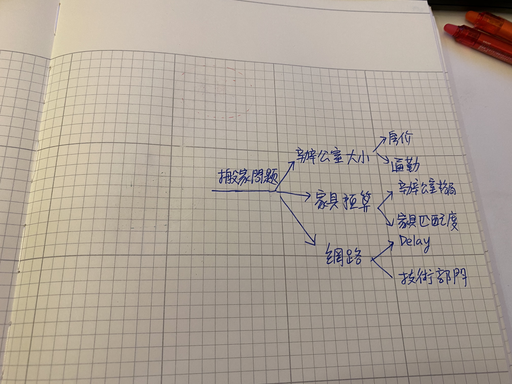
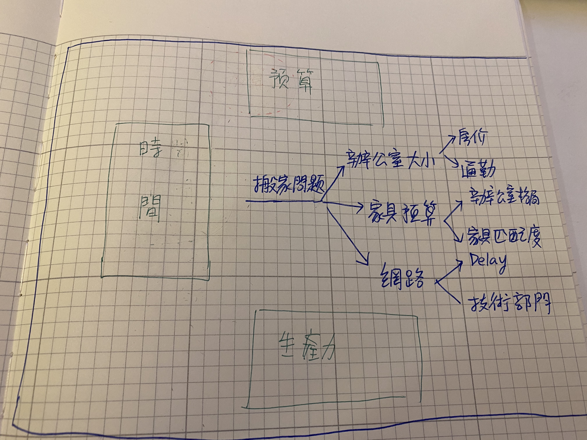

# Ch-3 转换维度，找到全新解题视角

这一章。我想谈的是维度。人类的大脑，之所以低效，主要因为一个关键的原因：

99% 的人类只有一套演算法：

> 直线思考以及暴力匹配。

遇到问题，我们以自己原始的角度去思考，然后列出几个可能选项，在自己的记忆、朋友的经验、书籍里面的乡野传说挑选一些可能的解法，尝试解决，暴力匹配。

人在职场为什么越老越值钱，就是因为数据库累积的样本够多，所以效率远高刚出社会的新鲜人。

这样的方法，在日常 90% 的场景里面都适用。但是唯独在两个场景里面不适用。

1. 这个问题牵扯到太多未知数
2. 这个问题过去自己完全没有经验

## 人为什么会有拖延症？

如果在工作上，有事情我们没办法解决，可以雇用资深员工或向前辈请教。

但生活上的事呢？有些生活上的事，没有经历过，要如何解决。在生活中，我们都患有一种讨厌的症状，叫「拖延症」。明明知道自己该去做。但却提不起劲做。

这种心理疾病，不只新人有，资深的人也有。

「拖延症」的病因有二：

* 拖延症的产生，通常是因为要面对一项自己不知道难度，也不知道长度，也不知道风险，还可能耗时的巨大项目。没有头绪如何开始进行。
* 问题难度太大潜意识对大脑自动发出警告，情绪一涌而上。造成了二次恶化。

在人类的大脑机制当中：负面情绪、负面记忆，在整个大脑的决策过程当中，占非常高的优先顺序。

这是因为人类祖传的内建机制，遇到负面的事情先逃跑，否则我们会死亡。

所以当我们遇到很难的问题时，第一时间总是选择逃避。因为不想因为不堪重荷而死亡。

## 用潜意识反向解题

在《打造超人大脑》这本书里面。我介绍了一个强大的密技去解决拖延症问题：以潜意识之道还潜意识之身。

我们之所以会产生强大的拖延症，是因为潜意识用负面情绪攻占了大脑决策，阻挡了我们的行动。

如何解决这个问题呢，我在书中提了一个解决的方法。就是抒发恐惧：

假设你是一个职场新手，却被老板交付了40天内办公室搬家的重责大任。这时候你一定会想要问候老板的娘亲：我没有做过这些事，到底要怎么企划进行？脑袋接著下一秒就会想：办公室要多大，坐不下要怎么办？要买啥家具，买到预算超了怎么办？搬家要重搞网路，网路到时候没就位怎么办？

（妈的，老板怎么神经大条，就这样把这么难的问题，丢给我？）
（批哩啪啦，可能脑袋里面瞬间不假思索就冒出几十个这样的念头。都是恐惧、情绪，但没有解法。）

这时候，不要著急。

#### STEP 1: 写下你的恐惧

拿一张 A4 纸，把你担忧的事情都写下来。在这个搬家案例中。原先我们可能的忧虑有：

* 要搬到哪里？预算会不会爆？
* 要搬走什么家具，家具哪些要重买阿？会不会到那里漏这个那个？
* 网路移机怎么办？到时候没签好怎么办？
* 同事东西要搬走。到时候搬家时一团乱怎么办？
* 搬家要花时间，公司生产效率会掉几周，怎么办？
* 公司要换地址，同事通勤时间变长，通勤费用变高怎么办？
* 有很多电脑到时要搬移，当中摔碎或遗失怎么办？
* 万一现在好选择不多？只能迁就新的烂办公室怎么办？
* 新办公室没有旧办公室舒适，同事会抱怨怎么办？
* 什么时候要宣布搬家？如何向同事宣布而不爆炸？

#### STEP 2: 反过来变成 TODO LIST

这时候，我们再拿一张纸反过来把这些问题，都变成一条肯定句的任务。

1. 与老板确定搬家可能区域。预先联系好该区仲介。
2. 询问老板办公室每个月预算（含最终开销）
3. 列出公司内大项家具清单。对每样家具最初搬迁评级。评估费用以及重买难度与成本
4. 调查如何申请新网路，网路带宽上限，以及网路申装需要花费时间
5. 预先清点每个同事所需纸箱，先行购买纸箱数量。
6. 预先清点每个同事个人办公设备。计算包材数量，以及保险费用。
7. 找出谁在搬家期间生产力下降，会受到严重影响。预先做好排班调配。
8. 私下调查每个员工的通勤状况，并向老板申请通勤补贴
9. 调查每个同事的电脑设备清单，预先估算保险费用，并向老板报备
10. 先开出预算与需求让仲介寻找。订出上限与下限。
11. 找出同事最喜欢旧办公室的哪样特点。想办法在新办公室移植。
12. 在搬家前两周向大家宣布，并且有搬家指南 SOP
13. 预先确定好装潢工期，搬迁时间，最快可搬入时间。

原先我们进行一项这样的大工程。

首先很可能想到的不是第一步我要怎么做，第二步我要怎么做。而是什么事情如果出包了怎么办？什么事情我不会做怎么办？

负面的情绪瞬间爆出一大堆。正面的解法没几条。

但透过这个方法，你会得到超神奇的结果。怎么突然间透过这种方式，80% solution 怎么好像就全部写完了。虽然看起来有点乱，但是好像开始有了点头绪。

其实我们潜意识有很强的 sensor，搜集了一大堆资讯，只是我们大脑不懂的利用。

用这种先抱怨再反过来列 solution 的方法，难度下降了几百倍。

然后我们再对这些问题进行打标签。又可以将这些问题大致分成三种类型：

1. 时间
  * 调查如何申请新网路，网路带宽上限，以及网路申装需要花费时间
  * 在搬家前两周向大家宣布，并且有搬家指南 SOP
  * 预先确定好装潢工期，搬迁时间，最快可搬入时间。
2. 预算
  * 询问老板办公室每个月预算（含最终开销）
  * 列出公司内大项家具清单。对每样家具最初搬迁评级。评估费用以及重买难度与成本
  * 预先清点每个同事所需纸箱，先行购买纸箱数量。
  * 预先清点每个同事个人办公设备。计算包材数量，以及保险费用。
  * 调查每个同事的电脑设备清单，预先估算保险费用，并向老板报备
  * 先开出预算与需求让仲介寻找。订出上限与下限。
3. 生产力调配
  * 与老板确定搬家可能区域。预先联系好该区仲介。
  * 找出谁在搬家期间生产力下降，会受到严重影响。预先做好排班调配。
  * 私下调查每个员工的通勤状况，并向老板申请通勤补贴
  * 找出同事最喜欢旧办公室的哪样特点。想办法在新办公室移植。

看著这个分类，你突然发现原先的问题好像有解了。至少我们可以把原本整沱的问题，拆解成三组问题，各个击破。

甚至你可以开始找出风险事项，以及规划时间轴：

#### 风险事项

从以上的待办清单当中，我们再找出有可能出包的部分：

* 装潢时间
* 最快可搬入时间
* 仲介找房速度
* 签约交屋速度
* 网路安装时间
* 家具购买运送时间
* 公司运营调度

再经过这样一次分类：

* 装潢时间（外部）
* 最快可搬入时间（外部）
* 仲介找房速度（外部）
* 签约交屋速度（外部）
* 网路安装时间（外部）
* 家具购买运送时间（外部）
* 公司运营调度（内部）

你会发现，甚至这些风险事项。几乎都是卡在外部合作单位的环节，而非内部。所以我们甚至要从外部的时间轴开始规划，而不是内部的时间轴。

#### 1. 准备期

所以第一阶段应该做的是：

* 先找老板讨论区域与预算，联系仲介看房。抓看房的时间，并且决定新办公室的下限需求。
* 先去网路营业厅谘询装机事宜，找出最晚应装机时间，并且同时提前联络网路设备厂商
* 预先抓出施工最晚开始时限，最晚完工时限
* 通知部分负责人，有关搬家事宜上的人员调度

这时候，就可以先让最容易出现问题状况的事项。拥有最大的时间容忍弹性。并且可以第一时间把任务分派出去。

并且开始准备：

* 列出公司内大项家具清单。对每样家具最初搬迁评级。评估费用以及重买难度与成本
* 预先清点每个同事所需纸箱，先行购买纸箱
* 预先清点每个同事个人办公设备。计算包材数量，以及保险费用
* 私下调查每个员工的通勤状况，并向老板申请通勤补贴

#### 2. 实做期

这时候过了 10 天，新办公室差不多拿下了。

开始可以：

* 联系工班进场
* 申请网路
* 购买新办公室家具，布线
* 整理旧办公室平常闲置的大型器材
* 联络搬家公司，预先进行第一轮估价
* 排出搬家期间值班人力以及相关调度
* 买齐所有包材
* 安排新办公室收货整理的同事
* 撰写搬家同事需要遵循的 SOP

#### 3. 细节期

* 搬家公司实际进场搬家
* 协调旧办公室留守的同事帮忙打包
* 新办公室的同事收货，并且测试基本设施与网路的运行
* 安排新办公室清洁人力
* 购买办公室小家具，绿色盆栽，零食，休闲用品等等

最后整个工期、预算甚至是可以被估算的，大概 35-40 天，预算 100 万台币左右。

## 一维与二维的世界

我们再回卷到老板刚丢给你这个任务时，你的第一个直觉想法是什么？

* 办公室要多大，坐不下要怎么办？
* 要买啥家具，买到预算超了怎么办？
* 搬家要重搞网路，网路到时候没就位怎么办？

然后接著你就会继续想

* 办公室要多大，坐不下要怎么办？
  - 我们要换到哪一区？哪一个的房价是多少？
  - 只有某某区才有大坪数。但是同事住的地方都离很远怎么办？
    - 我要如何平抚来抗议的同事
* 要买啥家具，买到预算超了怎么办？
  - 要先确定办公室格局，我才知道要换哪些新家具？
  - 我不知道哪些家具是可以搬的，哪些要买？
  - 老板有多少预算？我不想因为超支被炒鱿鱼。
* 搬家要重搞网路，网路到时候没就位怎么办？
  - 搬家除了要花钱，还要换工位，还要重拉网路
  - 公司的网路有点特殊，这方面我完全不懂，要如何找工程部门的主管评估协商？

这些问题你都不知道答案。甚至有些问题还是地雷。比如说超支了怎么办？让公司掉生产力怎么办？

## 换个方向，解决思维与效率完全不一样

但为什么我们后面用了潜意识「反向法」以后，这个问题就变的有解了呢？

让我画一个图解释给你听：

原本在我们人类的思维视角里面，是一直线的，所以你只能想出有限的选项，而当有限的选项生出未知的分叉时，因为你没有经验（可以进行匹配），就会当机超负荷了。

而由我们「反向法」的方式，你会发现问题症结点是：

* 「时间」
* 「预算」
* 「生产力」（甚至可能是「外部与内部」）

与你当初设想的「办公室大小」「家具大小」「网路安装」，完全不一样。

## 未知问题适合用二维思考

我的朋友刚开始都称这招为「逆向思考」，后来我发现，这个方法更适合称之为「二维思考法」。

为什么这一个方法会有这么神奇的效果？

这是因为人的的思考是一维直线。而真正的问题区域其实属于二维平面。

人类原先的一维决策直线匹配（甚至充满断点）是到解决不了二维平面上四处散落的问题。所以我们就会下意识上觉得这件事无解。

而办公室搬家这种小概率事件，在职场上也不可能有人写 SOP。所以自然你也没有办法开启匹配模式。

我们人生当中以为的超大难题，通常是因为这种直线性思考。换个维度，你会发现原来的问题都不是问题。

一旦你知道「维度」概念，并且有办法换维。

那么很多难题，看起来就不再是难题，甚至你能找到起始的思绪。
