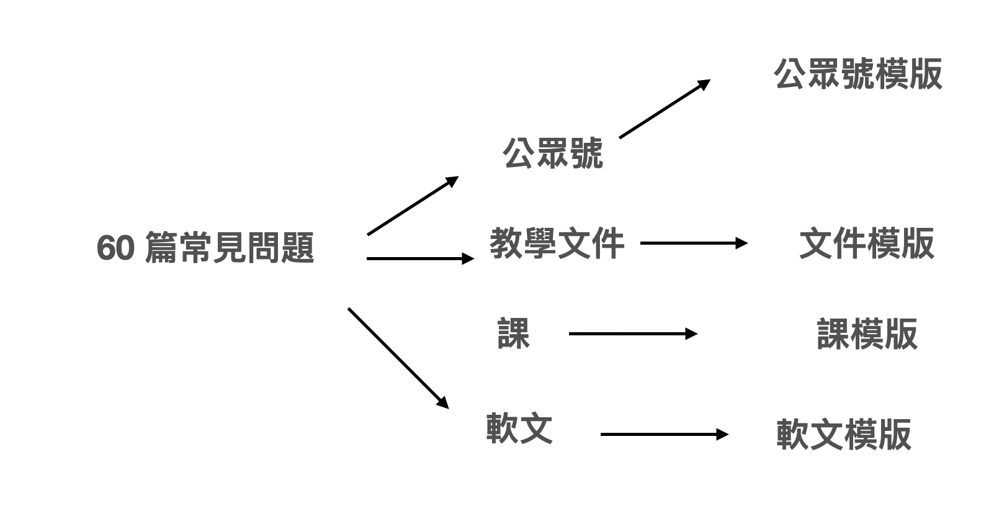
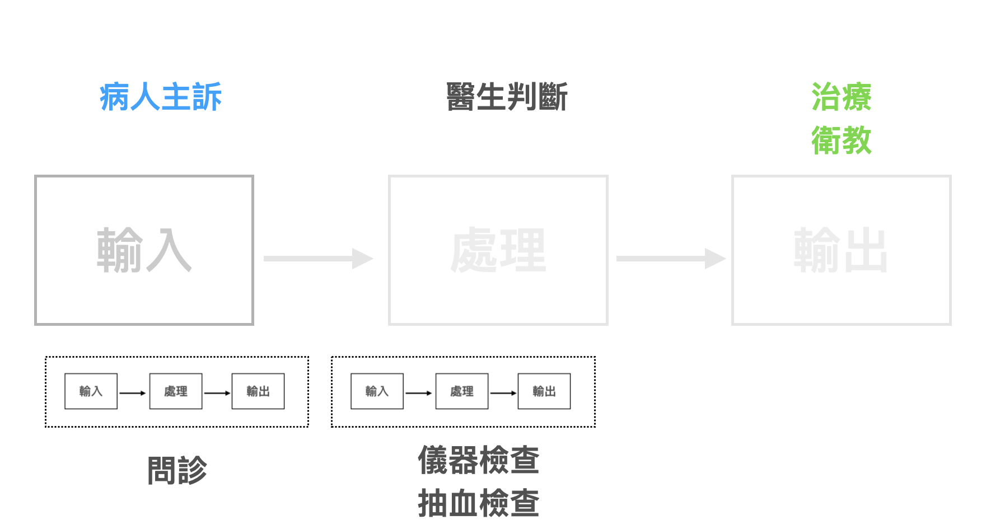
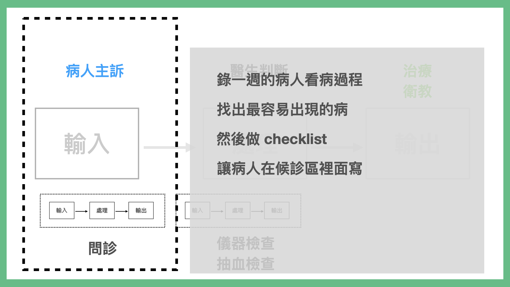

# 第四章　黑魔法般的編程思維

作為一個程序員。我常覺得程序員這個職業被 Overrated。外界常覺得程序員是魔法師。我們卻常覺得我們自己是碼農。只是用生命在農耕而已。

而且，程序員雖然高薪。但是這行卻只有一個隱藏秘密。就是程序員這個職業很短命。一般來說 22 出社會，到 30 出頭會最高薪。35-40 歲就可能下崗被迫轉行。

這是因為編程真的是一門新興行業。很多程式語言到目前的壽命從誕生到現在只有 20-30 年而已。但是，因為科技的發展，行業每十多年就會有誕生新的應用方向，產生新的語言。

而學習一門語言精通要時間，這個過程至少要 5-7 年以上的時間。但是程式設計師的職業壽命卻只有12-18年上下而已。

為什麼程式設計師職業壽命會這麼短命呢？為什麼這行不像老師、律師、醫師一樣，是越幹越值錢呢？

我後來終於想通這件事了。

我打個比方來說好了。我覺得程序員這個行業，比較像是職業司機。程式語言就像車一樣。一班人在解決問題，都是用手工方式解決。而程序員就像會開車的司機，可以快速將你帶到想要的目的去。所以，程序員的薪水非常的高，因為寫好一個程式，可以爆發的生產力是數倍到數百倍。

然而，因為市面上，不同的車子種類一直在誕生，每種車子的駕駛方法又不一樣。比如說雖然開車駕駛技術應該都是相通的。但家用車、卡車、垃圾車、巴士、聯結車，他們的駕駛方法又很不一樣。所以一個程序員會開 A 車，不一定有辦法開 C 類型的車。

再者，寫程式不止吃技術，也很吃體力。所以，當然年輕的工程師非常吃香。科技公司的老板都知道 29-32 的資深工程師，C/P 值是最高的一群。所以 35 歲還是工程師的話，多數薪水並不會有顯著的提升，因為還有更年輕的能取代你。

但是這行更殘酷的是，你會開的車型，有可能會被淘汰下市。理論上你會開車，但實際上在業界你可能沒有車可以開了。所以接下來的問題，就是你還要再去學新的車怎麼開呢？那問題又變成，你如何跟 20 多歲的人競爭開車崗位呢？

但是，會開車這件事還是很迷人。畢竟可以比很多人高效很多倍。

### 為什麼很難在程式學校裡面學會寫程式

我曾經開過程式學校，學生口碑也很不錯。但是開程式學校這件事也很頭大。因為，開程式學校目前來說，在程序員界是很政治不正確的。無論你教得再怎麼好，一定會遭受到攻擊。（通常沒被攻擊的，多數是因為教得爛，很多學生從入門到放棄，以為是自己天賦不夠）

為什麼會遭受到攻擊呢？

第一個原因是擋人財路。程序員是一個高薪職業，高薪的原因有兩個原因，一是提高產業效率，二是程序員野生居多，供應稀少。一旦你能成功供應大量的程序員，業界就會大大的跌價。那麼原有的程序員就會不爽了。這就像計程車司機抗議 Uber 司機搶他們飯碗一樣。

第二個原因是學會開車，不代表能當計程車司機。

有的人來學寫程式。是因為只是想學駕駛技術。另外有一類人，是想成為職業司機。而且目前佔大宗。

但是教會一個人開車，不代表這個人最終能夠當計程車司機，考上駕照對吧（還有其他因素，比如說要當計程車司機要熟路，要親切待客，要懂做生意等等）。

但是學生期待是這樣的，甚至業界看你的眼光，也是這樣。坦白說，程式學校最強也只能帶一個人考上職業駕照而已，不代表這個人最後真能開計程車司機，甚至保證賺大錢。

第三個原因是期待不一。

程式學校目前多數還是以職業司機為導向。教得是你某一類車的開車法。如成唯一個 Python、Ruby、JAVA工程師等等等等。

市面上很多人其實只是想要學會駕駛技術而已。並不是真的想真正想開垃圾車。

所以當他們一碰到程式語言語法，就昏頭了。入門一套程式語言並且到能解構問題，真正用這門程式寫出解答，我算過，大概至少要粗估碰100個單字與知識點以上。所以很多沒碰過程式的一般人，剛入門就放棄。

因為這些學習者，希望學的是如何解構問題，但是學校課程要過那麼難的關卡，才能開始學解構問題，沒有人有那個美國耐心。

更何況是，很多程式學校教學者。自己根本不懂解構問題，何況教人。

### 你該學習的是編程思維，而不是編程語言。

我後來發現，一般人跟程式設計師講想要學寫程式時，程式設計師往往理解的是他要學開垃圾車，去當職業司機。這時候通常就會覺得對方薪水已經夠高了，沒事幹嘛想轉行。

但實際上，對方可能說的卻是他想學開車而已。

但是，有辦法將特定車輛駕駛方式與駕駛技術的學習剝離出來嗎？

我認為是可以的。其實「駕駛技術」，甚至有個專業名詞，叫「編程思維」。

超強的資深程式設計師往往有個通靈的能力。就是你跟他講目前的一個苦惱，他能夠瞬間跟你講一個全新的解法，並且能夠拆解細項任務、準確的預估所需要的工期、時間、人力調度，並且高效的完成任務。

這個超能力，在一般行業的老師傅身上也有。你應該見過一些資深的水電師傅，甲級電匠。做工程時也有超強的超能力。並且能夠拆解細項任務、準確的預估所需要的工期、時間、人力調度，並且高效的完成任務。

這個相同的通靈能力。其實就是編程思維。差別只是程式設計師能夠將所有的任務，用程式語言連在一起，放在機器上，以千倍的速度跑起來。

只是，不管什麼行業，擁有這個能力的人。往往不是工業訓練出來的。而是藉由大大小小的任務，累積粹練出來的。所以多半不懂怎麼「教」。

## 「程式」並不是一個黑盒子，也不是一段黑魔法

那麼。我們要怎麼學「編程思維」呢？

首先我們來談談程序員跟一般人對「程式」這件事的角度，其實有很大的不同。

第一個最大的差別。就是普通人覺得「程式」是一個很大的盒子。

但是在程序員的眼中，其實程式只是一大片的代碼而已。

再來呢？程式並不是一個巨大的盒子。

更精確的來說。程式是一連串的小盒子組成的具體產線。

所以，實際上「程式」在程序員的代碼庫裡面，是多段代碼片段形式的存在。

而，更讓人驚異的地方來了。很多人認為網路公司，應該就是一個用代碼庫運作的地方。

實際上網路公司的運作更可能是這樣的

網路公司裡面的流程，並不是全然自動化。甚至，我還遇過這樣的情形。

之前我在開設比特幣交易所的時候，比特幣交易所每一個帳號背後都要 KYC ( Know your customer)，原本我們是用人工審核客戶的證件。但是後來用戶量實在增加得太快。於是我們去找到了一間公司，號稱是電腦自動辨識證件真假，後面有 AI 人工智能的公司，一張證件辨識費用收費 1 元美金。

基於公司業務量真的吃不消，於是我們只好忍痛採用這種高效的自動服務。

但是，後來我們卻發現這個服務，好像不太靠譜，有時候會被一些惡意客戶，用一些低級手段騙過。照理來說電腦應該可以抓到這些低級錯誤才是。

後來我跟業界打聽，才發現這間公司才不是什麼鬼人工智能公司。他們是做了一個程序化接口，但是後面實際審核的方式，是外包到印度用人工去審核。!@#$%^ 所以才會被用低級的手段騙過。

為什麼會出現這樣的情形。有幾個原因：

1. 程式語言不是能夠自動解決世間上 100% 的問題，所以某些關鍵問題，可能還是要手工判斷解決執行
2. 有時候某一些問題，用電腦解還是太貴。不如用人工執行。
3. 有時候甚至是算法太難。以現在計算機科學的程度，程式設計師根本還不能做出演算法，但人眼一能就能判別。乾脆中間就換成人去執行。

所以，沒有寫過代碼的人，往往會覺得他找一個程式設計師外包，應該能夠實做一個黑盒子，完美解決他遇上的所有問題。如果解決不了就是這個程式設計師違約，或者是能力不行。

但事實上，程式的世界並不是這樣運作。

## 輸入、處理、輸出

好。即便不能 100% 程式化。那麼我們如何將遇上的問題，至少拆成這樣執行的小塊呢？

2020 年我心血來潮。想來做一個更簡單的編程課（直接就叫「不用寫程式的程式課」），原本教材都寫好了。但我不確定我寫的教材適不適合大家用。

於是就發了一個問卷，問大家要解決什麼問題。結果問卷回收以後我驚呆了。大家想要解的問題，跟我想的完全不一樣。自然我之前的教材都要作廢了。

大家提出了一些想要解決的問題。

如：

* 各種學會繳費單收到後，自動去繳錢
* 印刷廠電話詢價報價
* 藥師收到處方簽配好藥提醒病人回來拿藥
* 商務拜訪，收到名片，後續跟進
* 跟客戶提案、安排老師教學，
* 整理公司報帳單，分析預算花費
* 病人看診問診，判斷分類，後續衛教追蹤
* 旅遊業客人報名，預定安排行程，通知出團

這些問題，不僅是我傻眼，讀者看到這裡肯定也傻眼。這些問題程式都能解嗎？

可以。

其實，經過整理，這一類問題其實都是一樣的。

比如說藥師場景。

印刷場景

報帳場景

而「輸入、處理、輸出」這一個動作，其實有個名字叫流程化

而我們認為的寫程式，其實是

而一般人像工程師說，他想學寫程式時，重點往往會放在自動化

但我認為一般人其實缺的是問題分解+流程化的思維

因為。如果你只是要提昇效率的話。只要問題能夠被分解，並且流程化。其實光這麼做，就能節省成本。變得更更有效率。（比如說找工讀生，替代掉昂貴的部份）

### STEP 1: 標準化輸入

那麼。我們又要如何將問題具體流程化呢？我認為第一個步驟，應該是將問題的輸入輸出的接口明確。

這是什麼意思呢？就是就是將各種問題，輸入的形式明確出來。

比如：

* 各種學會繳費單收到後，自動去繳錢
* 印刷廠電話詢價報價
* 藥師收到處方簽配好藥提醒病人回來拿藥
* 商務拜訪，收到名片，後續跟進
* 跟客戶提案、安排老師教學，
* 整理公司報帳單，分析預算花費
* 病人看診問診，判斷分類，後續衛教追蹤
* 旅遊業客人報名，預定安排行程，通知出團

就能梳理出

接著我們再將這些輸入標準化。以業界常見的形式，你可以將這些形式變成 Excel。

### STEP 2: 資料庫化

為什麼要將檔案轉成 Excel 呢？這是 Excel 是地表上最流行也最簡單的資料庫形式。不僅 Excel 本身就內建一些資料庫功能。程式設計師也有一堆 Excel 轉檔成資料庫的方法。

一旦將輸入標準為資料庫形式。那後續就可以批次處理需求。

一旦你將輸入資料庫化。那麼「處理」這一部份，資料庫就能解決很多問題

### STEP 3: 將資料庫接到各種輸出軟體上

雖然我們有不同的輸出需求。

但是因為業界有很多的現成 API。只要你有資料庫，要批量做這件事情不是很難。

在這個過程中，你不用寫程式。甚至找工讀生取代都行。

如果你的流程，工讀生都能做。那才表示程式能做。因為程式，就是用來取代工讀生做的最後一道手續。

其實，當程序員在聽你的需求時，他腦袋裡面，其實想的就是如何分解成這樣的流程。

然後，程式設計師做的，就是將這個過程不斷的再往下拆

最後，再將這一塊一塊盒子代碼化。

## 將編程思維應用在生活上

我們又如何用這套思維，來拆解日常生活遇到的問題呢？

### CASE 1: 將英文書翻譯成中文書

一直以來，英文書的觀點就是比中文書的觀點稍微新穎一點，快一點。但是，無奈翻譯一本書需要時間。看過打造超人大腦這本書的朋友，應該都知道我有一套黑科技，能夠將剛出版的英文書翻成中文書。

那麼，這種黑科技思維是怎麼做到的。

我這裡就講解一下大概的思路。其實也是輸入 => 處理 => 輸出的思維。

接著。我們再定義輸入與輸出的格式。

但是，我們手頭上只找到一個稱手的工具，叫做 Google 翻譯，但是 Google 翻譯的上限只能是 5000 字。

於是，我們可以再重新定義「什麼是英文書？」它可以是 20 篇英文文章。而「中文書」，也可以是 20 「英文文章」。

只要我們最後，再壓成一本書，就行了。

那麼。我們又要如何取得英文書的 20 篇文章呢？

其實也是相同的原理。再往下一層拆輸入 => 處理 => 輸出 。

這個問題又可以被分解成三種不同的作法，看你的技術高低。

所以。這個問題可以是非常高科技解。

1. 自己寫破解程式，把文本抓出來，自動接到 Google 翻譯上，然後程式再自動組起來變成一本中文書。

又或者可以非常低科技解：

2. 買一本正板書，請工讀生打字。並且貼到 Google 翻譯上。再且工讀生複製貼上變成一本書。

但是他們都解決了問題。關鍵在於怎麼去拆解這個問題，並且流程化。他們只是有速度與準確度上的不同。

如果原本你不懂寫程式，你可能認為這是一個黑盒子。實際上，這個問題其實是可以拆成 6 個盒子以上的。端看你要讓整個程序多自動多省力。

### CASE 2: 批量產出高水準的財經文章

第二個例子。我將難度再提升一點。

我有間公司是作財報分析的。這間公司有個部門，是負責經營公司微信公眾號的。一個公眾號（你可以理解成 Facebook Page），一個公眾號，要有人訂閱，必需要有高質量的文章。

但是這個部門的產出進度很不如意，花了幾個月時間沒有做出什麼成績。即使找來幾個文案寫手，品質仍然差強人意，內容不好，自然也得不到多少點閱率。大家很氣餒，紛紛跟我抱怨這件事是不可能的任務。

結果我花了一兩周，就用編程思維解決了這個問題，不僅如此，還得到翻倍的點閱數與訂閱量。

**原始命題：打造一個高品質的專業****公眾號****（官方帳號）****，文章品質好，容易引起轉發。**

原先內容部門的想法是，打造好的公眾號的先決條件是內容要好，文章結構要好。於是他們想招聘有財經背景的人來寫公眾號。但是實際執行後發現不可行，因為有財經背景的人，賺的錢遠高於新媒體的工資，如果只找對方來寫稿，根本請不起。

於是他們換了一個想法：找有寫公眾號經驗的人來寫財經文章。人是找到了，但是遇到更大的難題。因為熟悉新媒體的寫公眾號的寫手學財經的速度太慢，就算能寫出文章，內容往往也錯誤百出，更搔不到痛點。所以寫出的文章也不能看。

後來同事把主意打到外稿身上。外面肯定有作者非常熟悉財務知識，寫作速度又快。但是合作了一兩篇之後，就覺得這樁買賣實在太虧本了不划算。更何況，就算不計稿費與點閱效益，外稿寫手也不可能高產量天天供稿。

所以內容部門一直很苦惱，找不到適合的寫手，又寫不出能增加點閱率的好文章來。

#### STEP 1：重新定義KPI

接手這個問題後，我重新定義了這個問題，搞明白這個問題要達成什麼樣的目標？然後發現目標

有兩個：

* 文章要高品質。
* 文章要高產量。

拆解這個大問題，它本質上就是「品質」與「產量」問題。

不過我發現，產量的問題最嚴重。因為每天都要更新內容，於是內容組天天寫文章，甚至是當天寫，當天上稿。然而因為寫作能力有限，光選題、寫作就耗了一天，寫出來的稿自然也就普普通通，難怪素質無法提升。

#### STEP 2  一次只解一個問題

我去觀察了其他公眾號，發現其他帳號並沒有每天更新，多半是一周上兩次稿。如果一周更新兩次，事情就簡單好辦了，因為可以降低寫文章的強度。

不過沒有備稿的問題還是沒解決。當天發的文章都還是當天寫，自然無法要求品質。所以解決問題的第一個重點應該是要求有備稿，有備稿才能買到時間，好好打磨文章。

但是我們不能奢求一次解多個問題，所以先解決產量問題。

#### STEP 3  數字化 KPI

我計算了一下需要多少備稿量。如果單周雙發的話，七倍的稿量應該會足夠。要準備好14篇稿子，而公司裡有3個文案，一人寫5篇，連續寫一周（每個人在一週內寫出五篇），應該就會有足夠的稿量。

#### STEP 4 提升速度產出

理論上3個人，每個人寫5篇，應該就能囤積夠用的稿子。但實際上不是。這3個人都沒有財經背景，一天光要產出一篇夠水準的文章都有問題。

我發現，他們一天寫不出一篇好文章的問題在於三個關鍵點：

* 選題（不知道選什麼題目）
* 財務知識（本身沒有財務背景）
* 寫作速度（有財務背景的寫手太貴）

於是我將這三個問題逐一拆開解決。

首先是選題問題。我讓同事搜集了大約40個有趣的題目，並且將題目分類。這樣就確保了「選題問題」，保證題目都是大家想看的。

再來，小編本身沒有財務背景，所以有行文上的困難。有財務背景的人，文筆卻又不夠好。

於是我將這兩件事分開。每天下午兩點半找熟悉財經的人，選三個題目深入解答授課。同事將課程錄音後，轉成文字稿之後，將內容寫成文章。這樣就能夠快上許多。

果然經過這樣拆解，文案組同事很快就產出了一堆文章。

不過下一個問題來了。雖然文案組能寫出夠專業的文章，但是下出來的標題不吸引人，結構也不夠精采，更別說要讓人轉發。

於是這時候我轉而去解決「提高品質」這個問題。

####  STEP 5 提升質量

一篇文章，要能夠稱的上是好文。有三大重點：

* 題目吸睛
* 內文好看
* 看完認同轉發

但是公司內沒有寫熱門文章的高手，讓小編去上寫作課，又緩不濟急。

於是我想了一個妙招。上網找了三本書：一本專攻標題寫作，一本專攻內容寫作，一本專攻如何熱門轉發。把書拿給內容組同事看，並規定他們要用極速讀書法寫心得筆記。

他們一看完這三本書，下午刊出的文章品質就大大提升了。因為這些書不僅傳授核心技巧，更有寫作模版。

#### STEP 6：重新調整順序

一般人解決事情，往往是對著問題蠻幹。失敗了就崩潰哭訴問題太難。

而程式設計思維是先將大問題拆分成具體的小問題，然後再將小問題分類，找出解決辦法。

手動重組順序，最後再將過程自動化。

#### STEP 7：變成新的內容工廠

照這個新流程，內容組順利了累積了幾十篇文章的原始材料。而我們進一步針對每一個運營模式，做出了不同的運作模版。以後要製造內容，只要挑選出適合的原始材料，貼上模版，就可以組成不同的產品。

### CASE 3: 醫師如何批量寫衛教文章

在上我的程式課的時候，好幾個醫師也問了類似的問題。他們平常看診非常累。但來的病人，都是類似的主訴，其實問幾個問題，大概就知道病人的問題是什麼了。而且需要做的衛教也差不多。每天重複這個流程，醫生都累了。

1. 是不是有個簡化流程，可以讓病人輸入主訴自動判斷。
1. 有沒有更高效的方法整理衛教文章

我說這還不簡單。其實也是類似的解法。

一般來說，看病的流程是這樣的。

那麼。醫生根本不用改變任何流程，他只要錄整診間一週的音。整理出最常見的主訴，然後寫下最常見的症狀，就可以整理成一張 checklist 了。

而整理衛教文章又更簡單了。也只要錄整診間一週的音。醫生也整理出最常見的主訴，然後整理最常見的衛教逐字稿，週末花一點時間改寫，就是一張一章的衛教單了。

而這樣都不用寫一行程式。也不必另外額外佔用休息時間。需要的只是一套錄音筆以及一套錄音轉寫程式。

## 程式設計思維＝拆解＋重組

所以這樣整理下來。你會發現資深程式設計師的思維與流程，其實是：

1. 使用者要達成什麼目的？
2. 拆解當中有多少個難題。
3. 先解決掉可以拆的難題，不能拆的就繞路走過，以後再解。
4. 不能拆的問題是否可以重新定義範圍，數字KPI化變成有解的題目。
5. 把分解出來的答案重新連結起來，組成一個新的自動順序。

最後，反覆改良其中的流程，直到達到自動化。

為什麼資深設計師與資深工匠，都能閃電般合理的解答，並且可以準確評估、難度、時間。其實是因為他們在腦袋已經做過這個流程，無數次了。
