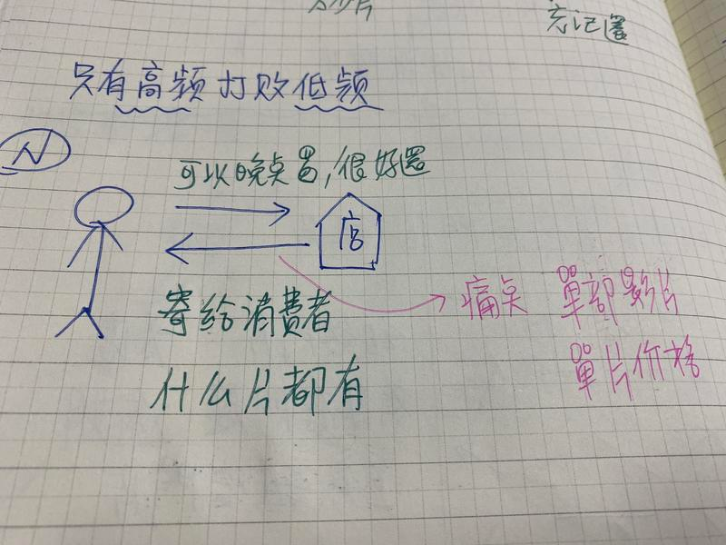
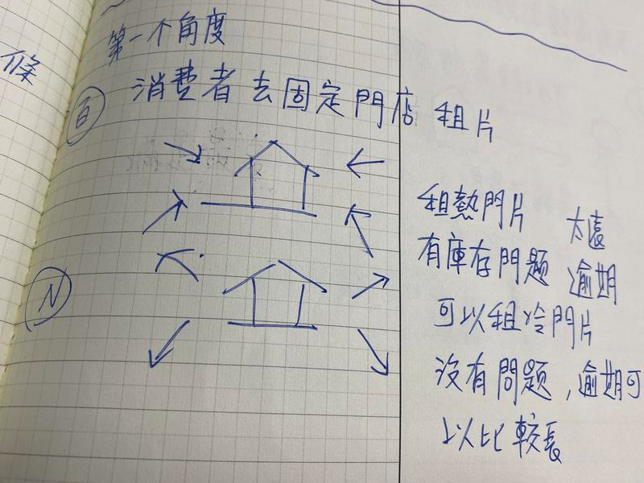
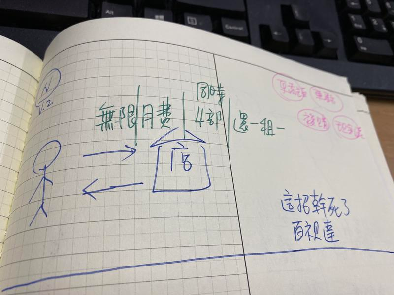

# 第五章 創新不是拍腦門

企業與人生中，共同面對最難的一個課題就是成長創新。那麼到底有什麼方法可以系統性創新呢？

對此，我想舉一個企業界大家最耳熟的能詳的例子，Netflix 去解釋拆解。

Netflix 可以說是當代最創新的一個企業，Netflix 最早也是靠租DVD 起家，後來成功轉型創流服務，打敗百視達。可謂是台面上熱門企業上競爭紅海難題成功創新的佼佼者。

當然，百視達最後被打敗了。現在 Netflix 又在前往哪個方向呢？

Netflix 近年來瘋狂的做起自製電影以及自制影片、還不斷的實驗互動式多結局影片、仿真動畫片等，志燒錢不手軟。燒到投資人非常擔心。

這又是什麼策略？

## Netflix 的第一段逆襲：利用突破使用者痛點奪下市場。

Netflix 的第一段故事大家都耳熟能詳。但 Netflix 真是只靠串流這麼簡單就打敗百視達的嗎？

1. 理論上百視達也能做串流不是嗎？
2. 在時代轉變時，每個廠家都能做串流服務，憑什麼最後贏的是 Netflix？
3. 做串流其實這招很險，大家都認為網際網路服務沒有邊際成本的。但是在網際網路服務這行，成本最重的就是頻寬。Netflix 為什麼敢燒錢從 DVD 毅然轉型成串流平台。

但是，不管是第一段的燒錢轉型串流策略，還是後者的自制影片策略。Netflix 卻一直以來表達這不是什麼問題。他們他們只有一個目標，就是增加訂閱戶。這個問題就會自動解決了。

一般人，看到這裡往往不是很理解。因為，每個互聯網公司都是這麼說，但是還是很多公司燒錢燒到最後倒了。Netflix 憑什麼成功呢？而且，Netflix 採取的模式，還是吃到飽模式，理論上這應該更費錢，更回不了本。

為什麼反而能奪下市場逆襲呢？

用一般理論可能說不通。但這裡有一個詞「吃到飽」，用這個關鍵字下手去拆解各位讀者可能就看得懂。

丟開看片這件事，我們將這件事情抽象化。你會發現 Netflix 本身很像一種餐廳，就是吃到飽餐廳。人需要吃飯。同樣的，注意力也需要被滿足（跟吃飯一樣）。

以前吃飯的時間是固定的。比如說每個人都是固定六七點下班，週末也休假。當時科技就是租DVD 休閒。

所以影集的模式就是一周一連載。但是隨著上班型態改變，科技型態改變。很多人晚上八點是看不了劇的。回到家都11-12 點了。只剩深夜秀，非常悶。

比喻來說，人作息時鐘變了。所以人沒辦法在晚上八點飯館開飯，但晚上十一點只剩麻辣小龍蝦。

所以人們會怎麼做呢？結論是他會去買冷凍便當。也就是變通個方法，去抓隔天出字幕的盜版影集，或者是乾脆等連載完一次看個夠。

所以Netflix 的看片特點，就如同隨時可微波的便當一樣，隨時可吃，並且允許一次吃七個便當。

### Netflix 如何打敗百視達？

當然，Netflix 也不是一開始就這麼厲害的。而是一間小公司。

在很久以前VHS 與DVD 還盛行時，大家都是開車到百視達去租片的。當時看片需要單片出租，有嚴格時間限制，並且有高額違約金。

Netflix 剛創業時的角度，從消費者的痛點切入：

* 需要開車去租片=> 可以請Netflix 寄給租片者，並且可以郵寄返還
* 店裡面租不到冷門片=> Netflix 租得到
* 逾期寬限時間短=> 逾期寬限時間長

當然，這使得Netflix 先取得了市場的一部分份額，但不足以擊敗百視達。

##
### Netflix 擊敗百視達的轉捩點：15.95 USD 無限租片

Netflix 真正打敗了百視達的設計。是將單片租借制，改成了吃到飽模式。消費者只要付15.95，手上可以同時有4 部片子，沒有還片期限。還一片就可以再藉下一片。

這一步棋徹底解決了消費者的痛點。

原本消費者最大的痛點在於"還片"。很多消費者不是不想還片，而是片真的沒看完。但是原先設計還片的機制設計的很死板，逾期金很高。

Netflix 一舉取消了逾期金這件事。且改為月費吃到飽。讓消費者覺得十分划算。

且每個月繳納費固定費用這件事。大大保障了Netflix 的現金流。自此以後，Netflix 業績開始大幅增長。

### DVD 租賃改為串流

後來，隨著科技進步。Netflix 決定開拓線上串流市場。起初，因為頻寬昂貴，這項業務是非常賠錢的。許多股東也非常的不諒解。

但是，Netflix 毅然而然的轉型。從DVD 轉型線上主要解決了兩件事

* 消費者租片能夠更快，隨時隨地都能看片
* 消費者租片這個環節，再也沒有還片環節

Netflix 當時起步時，是用了3000 萬美元與StartZ 談了2500部電影與影集的播放權利。4年到期後，StarZ 將續約費用提高到3 億美元，Netflix 拒絕了。

Netflix自己不擁有影片版權，而與第三方談授權時間與授權部數的痛點是：片庫有限，消費者始終會看完站上熱門片。並且會被電視台或片商掐住喉嚨，版權續約費用昂貴。

所以有一陣子的短時間，Netflix 上面新增了大量Standup 喜劇、紀錄片、老影集。因為這些片子版權費用低，而且深受消費者喜好。

後來Netflix 摸清楚消費者需求後，又開啟了另外一環變革。

## Netflix 的第二段逆襲：重新發明好萊塢，解構電影拍攝成本

那麼。Netflix 現在的狂拍自制片，又是怎麼回事呢？這就是因為影片背後的版權費用實在太貴了。Netflix 在想有沒有辦法降低成本。

消費者一直有看好片的需求。然而，好片的定義是什麼？

一般來說，「好片」可以拆解成兩個元素「好演員」+「好劇本」。

而有名氣的好演員（如鋼鐵俠）一般來說非常貴。

但是如果深究下去。其實好演員是指演技好嗎？也不單純是。

好演員還可以分成三種類型：

* 「演技好」
* 「名氣大」
* 「會引流」

不過同時具備三者優點的演員超級貴。那麼是不是可以找「會引流」或「名氣大」但演技普通的演員來演自製影片，成本就能降下來呢？

所以，Netflix 近來大量了啟用　MCU 的其他演員（美國隊長、獵鷹），來拍Netflix 的影集與電影。他們雖然名氣大，但是漫威給他們的片酬其實相對來說非常少。Netflix 不但給他們不錯的片酬，同時 Netflix 的觀看量一向可觀，登上 Netflix 舞台，也有助於他們的曝光量。

這樣做不只讓影片成本大幅下降，MCU 演員的噱頭，也讓這些自製片引起更高的目光與話題。

我們再來談談好劇本。

好劇本的定義見仁見智，並非劇情高潮迭起，才能稱之好劇本。

在串流平台上，其實能夠吸引住用戶一直觀看的節目，反而是喜劇、做菜節目、懸疑紀錄題材。

因此，Netflix 甚至推出了由鋼鐵俠導演強法洛主持的做菜節目，首集竟然有許多漫威演員出鏡，如鋼鐵俠與蜘蛛人。吸引了更多粉絲。而且，這是非常擦邊球的行為，因為鋼鐵俠拍攝一部影集需要 5000 萬片酬。那麼他上這個做菜節目，需要付他多少片酬呢？可能連 5 萬都不需要吧。

但是在 Netflix 觀看時數上。鋼鐵人與做菜節目，一樣都是消耗觀眾 2 個小時。

本質上，消費者有消費好內容的需求。以前從每天一次，只能在電視機前面。到了每天數次，在家中各個角落。

而Netflix 就是當中的渠道商，第一階段：致力於消費者更容易取得影片，更少麻煩。第二階段：致力於讓好內容取得的費用更便宜。

### 奇襲神招：小龍蝦炒飯

我總喜歡笑稱 Netflix 實際上，是開一間「小龍蝦炒飯 Buffet」店。這是什麼意思呢？

當讀者理解了 Netflix 本質上，做的其實是餐館生意後。我們接著再來拆解為什麼一般海鮮 Buffet 不怕人家吃倒的原因。

市面上的海鮮總匯 buffet，為什麼能夠獲利。原因這些吃到飽的餐廳，背後股東通常有自營漁船。所以等於是成本價倒貨在賣海產，比賣到市場去合算多了。而且店面又是收現金，如果是賣給超市，要等 90 天之後才能收款。

所以　Netflix 表面上是連鎖 Buffet 吃到飽。本質上卻是直銷海產倒貨...

那麼 Netflix 只收月費，如何解決愛吃的大食客問題？這也是開 Buffet 餐廳的老版擔心的一件事。真有出現大食客，來狂吃高價海鮮怎麼辦？

這背後的解決方法就更簡單了。

雖然 Netflix 號稱自己高級海鮮吃到飽。（都是好萊塢一線影星拍的片）

* 第一，沒人進店就一直狂吃龍蝦，只吃吃龍蝦也會吐。同常也會嘗試其他菜色。
* 第二，Buffet 這種店往往菜色多元。推出很多便宜好吃的品項去墊滿顧客的胃。比如說港式茶點。一般人，往往在店裡吃多一點低成本的腸粉、炒飯、日式壽司，瞬間就飽了。比如說我因為覺得要招待我爸媽吃好料的。所以帶它們去海鮮總匯。但我爸爸每次去拿的是吃炒飯炒麵...
*
所以 Netflix 的手法，就是號稱自己店裡有賣波士頓龍蝦，而且可以吃到飽。吸引越來越多人來餐廳吃飯。但是實際上餐廳里供應最多的是小龍蝦炒飯。

所謂的小龍蝦炒飯就是 Netflix 的自制劇。

比如說 MCU 裡面的獵鷹，他被找去了演Netflix自製的影集《黑鏡第五季》。這部劇的內容是兩個黑人死黨，在玩一個虛擬實境的快打旋風，各為男女角。這兩個玩家打著打著在裡面肉體出軌了起來。但是在遊戲裡面床戲的部份，並不是由獵鷹出演，而是一對沒什麼名其的亞洲男女演員出演。你以為會看到獵鷹的床戲，結果卻是...。這不就是波士頓龍蝦與小龍蝦炒飯的情況嗎？

我再舉個例子，Netflix 還有另一部自製電影《可能還愛你》，作法也非常巧妙。這部戲的男女主角是兩個亞裔脫口秀喜劇演員。他們其實在喜劇圈裡面蠻有名氣的。但是一般觀眾可能很陌生。如果這兩部只有他們兩個，話題性並不高。於是 Netflix 很聰明，找來大明星基努李維「免費」客串。而這部片的預告片重點竟然還是基努李維與其貌不揚女諧星熱吻這種人神共憤的片段。果然，這部片就引起極大的熱烈討論與收視率。

如果你是 Netflix 愛好者。看到這裡你會開始覺得 Netflix這家公司真是搔，套路深不見底。

## 創新的切入點與你想像的不一樣

如果，不是這樣逐格解釋。你可能會覺得 Netflix 的兩次策略真是神機妙算。甚至還讓人摸不著頭緒。

其實這也跟我們前兩章在談的論點類似。跟一般人對創新的誤解與錯覺，認為創新是憑空出現。

為什麼我們總覺得能夠創新的人擁有超能力。這是因為創新的解決方案，並不存在過去的資料庫。你會覺得新的方案很神妙。

但是另外一方面，新的方案又解決固有的痛點，甚至解決方式都只是一般人能想到的方式，可能只是用了新的科技加上將解決方案重新排列組合而已。

Netflix 的創新一直不是拍腦門，而是另外一層的換維手法。

Netflix 不跟現有的敵人在原有的 DVD 鴻海戰場上競爭，而是將所有的痛點都抽出來，沿著「現代Device」（mobile phone）打造解法，形成了讓使用者看片的方便優勢。

而Netflix 現在的重新發明好萊塢計畫，也是將「拍片成本」的「痛點」抽取起來，利用解構製作成本（明星、劇本）以及觀眾喜好（喜劇、紀錄片、獵奇片、漫威明星）大數據的優勢，形成了在製作費上巨大的成本優勢。

原本我們在「創新競爭」這個領域，通常只會關心對手做什麼，我們就做什麼，去拼價格、品質、速度。這是直線思維的競爭。

但其實針對創新這個議題，真正該做的。卻是切碎與重構。解構用戶的需求，用新科技打散原本方案的時空與方案結構，搞不好可以找出比原有方案效率更好十倍的嶄新解法。
