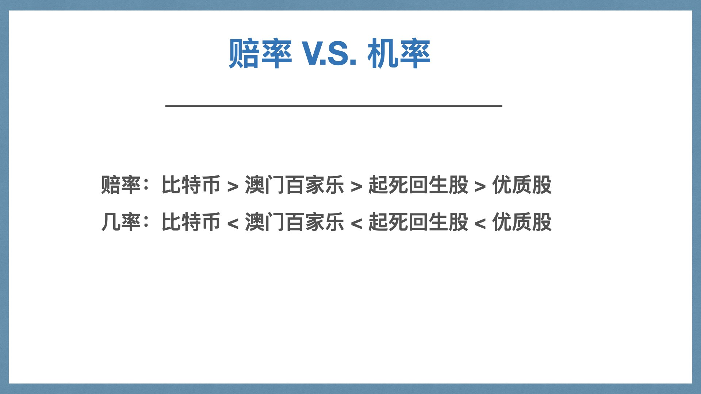
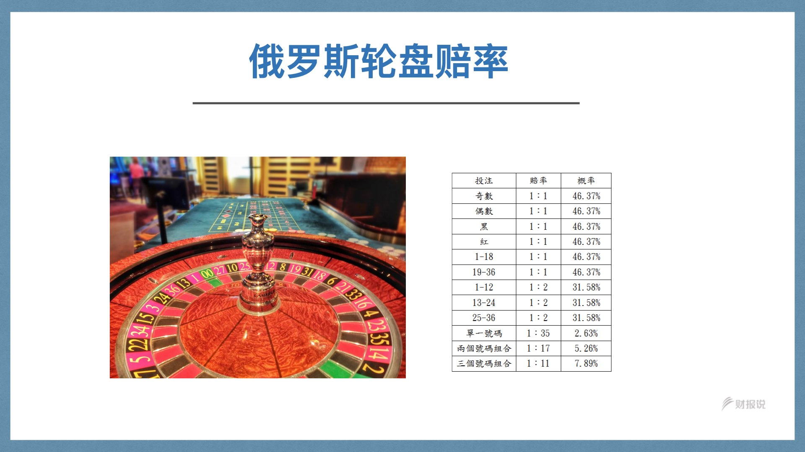

# 学会概率让你更幸运

在生活中。我们其实很讨厌「风险」这两个字。因为这个字在大众的脑袋里基本上就等于了「有失败的可能性」与「倒楣」。

但如果要我认真挑选两门应该在大学毕业前，人人都应该上过的两门课。

我会不加思索的推荐两门课。一门是财务管理、一门是风险管理。

因为学会：

* 财务管理：你能清晰的掌握这一生的金钱命运流动，依此去设计人生中的每个决策，甚至开对杠杆闪过大大小小的坑
* 风险管理：你能逐渐厘清最终自己要什么，并且越来越幸运。

# 「风险」究竟是什么？

对于风险这个字，大众未有统一共识。但是我们大概可以这样描述：

* 风险是对于「预期收益」的不确定
* 风险是“在给定情况和特定时间内，那些可能发生的结果间的差异”；
* 具有不确定性的损失就是风险”，
* 风险是在风险状态下一定时期内可能产生的结果变动”“等。

（注：风险定义摘抄自「公司财务危机论」里面）

人们之所以不喜欢「风险」这个词的原因是因为是，这个词往往背后带著两个隐含：

* 不确定性
* 不可预见的损失

简单又可以浓缩成一个词「不幸运」。

## 幸运/不幸运 = 与预期不一样

人民喜欢谈论「幸运」，却非常避谈「不幸运」。

但这两个词，在本质上是同一个词。如果我们再往下细拆，会发现

* 幸运的定义就是出现比原来预期更好的结果
* 不幸的定义就是出现比原来预期烂很多的结果

其本质基本上都是「与预期不一样」，只不过结果是往两个不同方向而已。

### 幸与不幸由何而来？ -- 概率

如果我们再往下思考下去。又会发现所谓的「不幸」，其实是肇因，对于「产生结果」与我们有一个既定的行为公式与预期，我们认为在过往多数时刻执行，都可以得到确定的预期的、好结果。但是在你这次执行时，得到远远偏差的「坏结果」。

我们人类思考的决策，其实是十分微妙的。

往往在我们的大脑中，会知道在世间上，每一种决策，都会产生不同的结果，有机会一样，有机会不一样。这就叫做数学中的「概率」。

世界不是像单向的剧情 RPG。与遇到的 NPC 对话，都只有一种选项，而每一种选项，都只会带到下一个确定的结果。而是每个不同的对话选项，会展开不同的剧情术，带出截然不同的故事结局。

假设这个章节有三个主要对话。即便你按照了别人的攻略，作了与别人相同的前两个选项，如果你在第三个对话，选了不同的选择。那么也有可能赢来不同的结局。

而且，因为你所在的这个世界不是死的，而是活的，不停的在更新。我打个比方，魔兽世界是个运行了十多年的大型线上游戏。游戏因为各种 bug 、运营需要，一直不断的调整。假设你今天是个谨慎的新玩家，想要养出一个好角色，小心翼翼的拿著攻略本照玩，同样的剧情章节，同样的技能配点，什么都按照标准来，在三个对话都做出来了一模一样的选择，但是最后可能还是养不出一样的角色。（因为技能改版了，武器改版了，你开不了某些任务，组不出理想的技能 build）

而这个结果，如果与你心中预想差很多的话。那么你就会觉得自己「很不幸」。

### 人类为么不幸运： 100% : 0% 的决策思维

我们心中会有「幸运」与「不幸」的最主要原因。在于很大的一个前提设定，这个前提连人类都自己没有注意到。那就是：世界虽然是动态变化的，不断改变更新的。但是在我们人类的惯性思维中，却会不知不觉以为世界是停止不变的。

所以在面对选项，且可以预知答案时（比如说基于自己过去经验，或者是别人口传的经验）。我们很容易会将原本世界可能是 70%: 30% 发生的概率，直接一概视为 100% : 0%

那么这样的习惯，在环境、时间、空间的条件都不同时，比如：

* 攻略的时间年代相差几十年
* 发生在不同的国家
* 辅助的资源与决策的时间不同

概率会产生极大的变化。70%:30%，有可能就因为诸多的条件，变成 30%:70%。我们的惯性思维，就很有可能将我们「自动」的带进坑里。

## 不幸的原因：「惯性思维」

你可能会以为「惯性思维」是人类的一个 Bug。恰恰相反，他是人类的一个 Feature。

为什么人类有惯性思维？是因为人类的计算能量极其有限，举个例来说，从你出门到公司这一段一个小时的路程当中。

可能就有上百个决策要做。

你真的每一件小事都要进行微小的选择时，想想一小段路的游戏，就有一百次对话要抉择，光想就头疼。那么最省事的方法，当然就是按下 Enter 不放，一路快转过去。

为了省时省事省能量。我们会下意识的养成习惯。当 3-5 次得到差不多且令人满意的结果，我们就会记起这个路径，直接储存当作预设策略。

而我们如果因为听从其他人多次也得到好的结果，甚至我们会依赖某个人的决策，直接使用他的决策而不加思索。

这样的策略在多数时刻都是管用且派上用场的。

如果我们硬要强行每样小事都要决策思辩，那么不变成一个多疑的偏执鬼，最后精神失常那还真的很难。

## 幸运的方法论　

人类会觉得自己幸运以及自己不幸运。其实正是因为绝大多数的情况下，我们都是一条自动化策略走到底，再随机因为世界概率的不同，出现觉得对于自己好或不好的世界、结果，觉得自己「幸运」或「不幸运」。

当然，是个人都想要更幸运。那么有没有那种不用花太多能量，又可以促进「好结果」的概率。其实还真有。这个议题我们还可以分为几个方向去努力。

### 1. 提高决策胜率

我在前作「打造超人大脑」曾经提过我过去总决了一套「幸运方法论」。这套幸运方法论是这样的。

我们往往以为都认为一个人的幸运是偶然。但其实真实世界并不是这么发生。如果我们把幸运与不幸的产生过程梳理下来，会发现：

1. 幸运是「好的结果」+ 「意想不到的放大与连锁」，霉运是「坏的结果」+ 「意想不到的放大与连锁」。
2. 所谓「结果」是「连续执行几件事」达到的「最终成果」。
3. 所谓的意外的幸运与霉运即是在「特殊场景」造成的「放大、连锁」效果。
4. 一个人一向幸运以及一向很倒霉，是因为人有一个幸运基数。

亦即，人解决某一件中等规模的事件，当中有若干小事件需要决策。把这件事情执行的最终收益，在数学角度的成果，不是加法 1 + 0.1 + 0.12 + 0.09 + 0.32 = 1.63。而是乘法： 1 \* 1.1 \* 1.12 \* 1.09 \* 1.32 = 1.27 。

在小事件里面，我们很难看出提高每个过程的数学结果有什么结果上的差异。甚至如果一个人老是执行效果差，老是做出什么损己的决策，单个世界结果的分数 1.10 对比 0.8 ，看起来也差不多。

但是，如果一个人遇到时代浪潮，大事件，许多放大的场景。我们假设 A 的平均幸运基数是 1.1，1.1 ^ 20 = 38.33。另一个人 B 的平均幸运基数是 1.01。那么 1.01^20 = 1.22。

那么。平常看似实力相差不多。但是在遇上大事件时，A 很自然的就会「脱颖而出」。因为「实力」相差过于悬殊。

有句话说，「机会是给准备好的人」，但其实在数学上本质上是「准备好的人全得所有机会」，因为任何狗屎球都可以被这种人打成全垒打。

### 2. 在大事件前切换成概率选择模式

当我们感到「幸运」与「不幸运」时，其实是因为「特别的被放大了」。导致你有感受上有强烈的差异。

而被放大有两种原因：

* 「事件过大」，导致微小的差异被放大了
* 「周遭环境差异过大」，导致概率落点完全的转变

我们前一则「提升实力」「提高环境胜率」这个策略，其实在某些情况下不适用。

因为「提升实力」本身需要「练习」，而有些情景的解法是「无法练习」的。比如说经历我们过去没有经历的事件，去我们没有去过的国家旅游。

这些是无法靠「反覆练习，提升经验、提升实力」去提高胜率的。

那么我们需要如何制订对应的策略？两个方向：

* 概率决策
* 对冲

我其实挺喜欢举旅游当例子的。因为旅游往往是验证「惯性直觉」、「环境空间时间错位」的绝佳例子。

有些人可能听过我讲这个例子。我如何把一次可能是灾难性的员工旅游，变成团友永生难忘的旅游经验。

2018 年时，我的一间公司决定在大阪开一次产品会议。但是，不刚好，在出发的前两三天，竟然碰上了台风。临出发的早晨（大约早上九点），团队坐了一两小时的车，来到场。办理 check-in 时，柜台多方阻挠、但不实际明说否取消班机，但建议我们改签，以免遭到取消。

我带著一个十几个人的队伍。同事都慌了。

这是因为

1. 当时是夏天，旅游旺季。如果我们的机票造成 delay，旅馆方面订房会接近全部泡汤，
2. 我们一行约 15 人。到柜台同时改签所有机票接近不可能。
3. 需多在大阪的行程，是已经预定好甚至买好门票的。
4. 我们没有使用旅行社，是自己安排所有行程，不可能有人帮我们处理好种种意外状况

如果机票被取消。我们的后续的整个旅程计画可能会整个泡汤，损失也高达六位数字。金钱与公司士气上，会遭到严重打击。

但是我最后却完美的解决这个事件。

### Step 1: 镇定，快速计算所有选项，

机票 check-in 旁边的改签柜台满满都是人。而我们有 15 个人。带著这么多人去排队改签，显然不切实际。

我当下安抚大家。出现台风没关系，我们手上都拿著行李。大不了真的飞不到大阪，我们当天就买机票飞去东京。

接著我让公司的行政，带著同事先去吃早餐安抚情绪。

然后，在餐厅里，我坐在餐厅计算赌飞机继续起飞不取消或者是采取其他措施的概率。

### Step 2: 赌概率高的选项，即便内心不希望发生

五分钟过后，我做了一个正常人都不太可能做出的决定：「我不计一切代价重买了隔天同一个时段所有人的机票。」

拿起手机全部重买所有人的机票，只是这个行程是原本来回行程各推迟一天版本。（我当时是用手机买大家的机票的，所以我手机里面存了全公司人的护照号码、名字、电话）。

神奇的是，在我在我买完所有人的机票。大家的手机都收到机票确认简讯之后。他们的又收到下一封简讯：通知原先的班机被取消了。

正当大家还在吃惊我如此幸运之时，手机又收到了下一封简讯，它们今天的临时住宿搞订了。我定好了机场旅馆。同事上网查，本来机票没取消前，原本机场附近是还有大把住宿，却在那短短电光石火的 10 分钟，被横扫一空。

等大家吃好早餐后，我好整以暇的带著整个队伍坐车去机场旅馆　check-in 休息，安慰大家没关系，我们明天再出发。今天受惊吓了，好好休息，晚上5点我再带大家去吃好料的。

回到房间，我悄悄预定了市区里面的一间米其林一星日式烧肉，晚上租了一台小台巴士进城。到了餐厅以后，同事都很惊喜，那天晚上我们还开了几瓶酒，喝的超开心。那一餐被同事誉为是进公司后办得最好的一次聚餐。

隔天，我们像没事人一样。飞到大阪继续原先的行程。好像什么事都没发生过一样。后续旅程十分顺畅。这次旅游，在 90% 的同事的记忆版本里，等同于只是提前多玩了一天。不仅没损失，还多赚了一天假期与一顿米其林美食，非常开心。

### 惯性决策下的连环不幸

写到这里。你一定会觉得我十分幸运。但是其实你不知道：

* 如果我当下没有决策，即时买了那些机票。五分钟后当我们的机票被取消后，如果要重新买新的机票，机位要排到2-3天之后。
* 我也不可能在当下定到机场旅馆安顿同事
* 如果 2-3 天再出发，我要面临的是让同事回家，或者是在出发机场的城市，多两三天住。然后多定大阪的旅馆2-3天。预算爆增。
* 如果按照 2-3 天再出发，我们需要延后 2-3 天再结束旅程。刚好那时候，大阪又出现了一个新的台风。而那个台风就是把关西机场冲毁历史性台风。

也就是如果我的决策错误，我们不只要延迟 2-3 天回去，而是延迟整整一周。整个旅程会变成大灾难。

连锁灾难没有发生在我们身上，发生了在公司的唯一一位团员身上。

我们公司有一位同事，在这趟行程中，部分旅程是跟我们分开的。当时他因为签证到期要重新签注的原因，所以机票并不是与我们绑订在一起。我们的班机是差不多时间起飞，只是我们在 A 行厦、他搭乘 B 航厦的另外一个航班。

当时，因为我们这边的旅程面临有可能全部被取消的不确定，于是，我再重新定机票时，也重新订了他的机票。

然后打电话通知他过来与我们集合。

然而，他还希望再等等，赌看看他的航班是否按照原订计画起飞。即便我们希望他一起行动，他还是想赌赌看。没想到，还是被他赌上了。于是，他按照原订计画起飞到了大阪。

同事当下都觉得他能飞到大阪很幸运。但是，故事还没完 ....

这段故事每次被我们讲起时，他都希望能够重新再选择一次...（泪）

当时因为大阪本身处在台风状态。所以抵达大阪时，其实班机是 delay 到达的。再者，因为台风真的很大，原先他计画搭乘 JR 前往市区，但是 JR 半路停驶。所以他只好在半路，想办法用他的破英文，拦截了一台计程车，继续前往我们之前订的饭店。（要知道日本的计程车费是天价。大约花了他一千多人民币）

折腾了半天。终于在晚上 23:00 住进饭店（原订15:30抵达），而且当时餐厅大多都休息了，所以他找不到饭吃吃，只能吃饭店酒吧的汉堡（400人民币1颗）。

与此同时，我们大队，在米其林一星日式烧肉店吃烧肉以及喝酒，简直不能再 HIGH。原本我们的计画是报复他抛弃我们大队先行一步去日本玩，所以在旅行群组里面贴了许多美食照片。但是，后来听到他的惨状，我们实在觉得继续损他的话，太没人性 XD

我们同事经过这次事件之后，都赞叹我决策水平实在太高，简直是稳到不能再稳。怎能够将一件本可能大灾难的事件，化得无风无语。甚至结局有点欢乐。

### 概率思维与对冲思维

其实，在这事件里面，我并不是没有损失。滞留在机场，多订机场旅馆，以及多订大阪旅馆，还多订了米其林餐厅。让这趟旅程的旅费爆增了足足 50%。

但是，如果我没有做出那个重大的决策「瞬间直接重买所有人隔天的机票」。可能这个旅程会 100% 直接完蛋。

为什么我会做出一连串正常人不可能做出的决策呢？

考量点有几个：

1. 根据我过去的经验与直觉，飞机取消的概率是极高的，地勤只是不想明说。当然，我们可以去柜台改票，但是我带著十几个人，柜台又挤满了人，当场改票这个手段不切实际。

2. 按照正常的直觉，几乎所有旅客都会赌人品，赌飞机不会取消。同时，自行多买一张机票。可能产生的情绪是：a) 多花钱 b) 赌错会有退票费。正常人都不会做这个决策。所以没多少人会去抢隔天的机票，数量正常，也还没起涨。但我看了一下退票规则。如果买了机票，最后不坐退票的话，一张罚 500 RMB。所以如果我重买机票当保险，最后原先班机起飞了，我无非就是被罚十几张的退票钱。但是如果我坚持要是赌人品的话。赌错的话，那真可不是花钱能够解决的事。当然我买完机票的瞬间，原先班机真的被取消了。

3. 发生这件事，大家的情绪都很慌。金钱损失是小事。原先行程泡汤，以及会议目的没达到，才是大事。所以先处理大家的安顿问题，以及安排压惊行程，才是重点。

订完机票后，我接连的就是定旅馆。也是相同的思维。

果然被我猜对了，我定完旅馆后，所有机场周遭所有空房都消失了。

其实，这个行程我们没有非去不可。旅费对我来说也不是小数目。我其实完全没有「强行冒险」的原因。

但为什么我会做出这个「反人性反直觉」的决策呢？

当时我面临著两个选项，

* A: 重买所有人机票 + 多定旅馆。表面上好像是多馀的，多花个几万人民币。事情没发生会被浪费。
* B: 赌人品。坚持等航空公司宣布。宣布后再决定。这也是一般人会做的选项。但是如果飞机被取消了，我的损失难以估计。

两者都会造成我金钱上的损失。但是 A 显然会开心一点会大一点。

但绝大多人会因为「不喜欢过去的投入变成了损失」，于是他会将「自己相信的选项」不理性的认知提升到变成了认定 100％ 发生的概率。

我的那位「倒楣同事」，他的决策逻辑就是类似的。明明有很多 checkpoint，只要他退一步，就不会产生连锁倒楣效应。他说：

* 他的飞机要起飞了。他在起飞前要是选择主动退票，能够退还的款项很少。而他不想承担这个损失。但他却忽略了，我其实也帮他订了一张机票。而他的代垫机票款的损失，我完全是能够帮他承担的。
* 他的惯性逻辑是，既然公司已经定好了饭店。那么这个饭店就是免费的。不住白不住。于是到了大阪还是一定要照原先的行程走住进我们原先预定的酒店。于是他费尽千辛万苦，花了高额的计程车费，执著折腾了接近八小时才抵达原订目的地。但却完全忽略了另外几个选项：
  * 他其实可以选择到了大阪以后，住机场酒店
  * 或者是他下车 JR 附近直接找一间酒店休息

任何一个选项都不会导致他又累又饿。但是因为他的思考维持著原先的惯性「省钱」。于是反而遭受到了更大的损失。而最终他花的计程车钱与餐钱，完全足够他在离开机场后，好好的休息吃饭。

写到这里，你明白了为什么在重大事件前，要切换成概率思维决策了吧。

事实上，我在旅行时，几乎绝大多数时间都是采用概率思维决策。

这是因为，旅行这件事，是人类最容易使用惯性思维进行决策却遭受的事件。旅行，很多人会将这个事件认为是「换个国家」进行「日常活动」的一件事。却忽略到了外国，其实时间空间环境所有因素都改变了。在国外，治安、交易、价值观处处不同。所以以往你在日常生活中的策略，很多往往都是行不通的。

更别说，旅行里面的出行费用里面，行动与住宿都是有高昂成本的。当你的行程（如飞机起降）受到阻挠时，后续的住宿与行李可能就会受到很大的牵连影响。当你又越避免损失时，反而会造成决定品质的严重下降。

### Step 3 对冲

我在个人商务出行时。多半还会额外的做几件事。

1. 买相对成本比较高的经济舱票，甚至是直接买商务舱票
2. 提前半天或是一天出发
3. 一定投保旅行保险
4. 一定住某种等级以上的品牌饭店

极端情形下，我甚至还会多买一张多的机票「对冲」。

这恰好也是一般人最不喜欢做的几件事，原因也很简单，「多花钱」。

然而，这真是多花钱吗？

其实，如果你回顾过去自己不幸的出行史后，你会发现一个模式：

* 每次都超支
* 每次都 delay
* 少数几次机票被取消。但是补不到票，或改不到票。
* 饭店住宿质量差

最后，可能你花的价格可能是跟我多花这些钱的成本是差不多的。

但是唯一不同的是，我可能「幸运」得到了「好结果」。

为什么明明可以「省钱」，我却要「多花钱」呢？

这就是游戏规则的理解不同了。

很多人往往以为航空公司提供的便宜机票，是机票的「基础」价格，于是要他「再多花一些钱」去买「比较贵的机票」，肯定不乐意。

但事实上，那些「比较贵的机票」，才是航空公司「正常的机票」，它们多数允许容易的退换改签。而那些「便宜的机票」反而是「特价的机票」，有点像是面包店里面快过期的面包，或者是 NG 品。自然弹性非常之小，也不会有相对应好的客服服务。

再者，为什么要保险。其实是在旅行途中，能够发生意外的概率实在太高了。保险是一个能够让自己损失，缓充转介到其他人身上的发明。你可以用相对低的代价，赌另外一个选择，来确保原选择一败涂地时，不至于损失都由自己承担。甚至保险的策略正确，有时候行程取消，保险赔的钱比你当初的旅费还高，反而赚钱。

## 俄罗斯轮盘陷阱

在一般的决策过程中，很多人之所以有惯性思维，盲目追求「自己认为的确定性」追到暴露在重大风险之中。

很大程度上是人们的思维里面只有「他想要什么」，没有「他不想要什么」。

当然，你可以反驳：我们当然「不要风险阿！」

但是「不要风险」不是一种「答案」。

原因是「不要风险」听起来像是「我盲目的认为这世界一定都不会改变」，「所以我不想改变策略」，但这件事情本身就是一种选择。

也就是当「世界一定会改变」，但你「不想改变」的时候，那么结果基本上就会倾向「你不想要或者没有意料到的结果」。

本质上，你还是在赌，却是赌在错的那一边。更精确的来说，我们如果想更幸运。要做的是让「结果」更「倾向」我们要的结果。而不是去「相信」会「变成我们要的结果」。

如何让结果「更倾向」我们要的结果。有两个步骤，

* 一：定义你要的结果
* 二：定义你不要的结果

这样说还是有点模糊。

让我来举一个例子。

前一阵子，我有一位朋友想要学投资。请教我学习策略。我说这个非常看个人状况。我无法给你一个确定策略。他问我为什么？

我说。人但凡想要学投资，不外乎是为了「钱能增长」，并且不断的强化「我要让钱涨的越来越快」的这个循环。然而，在这个过程中却没有思考，他「不要什么」。

比如说吧。我这个朋友，身家大约 1000 万上下。他能够拿来投资的闲钱约 200 万左右。这 200 万也是他花了挺久的一段时间存下来的。赔掉会心疼。于是他就不适合碰所以可以赚快钱的方法。比如说炒期货，追成长股这一类的策略。

为什么呢？因为，投资本身是追求投资资产增长的速度。而这个速度如果上升的快，下跌的也快。更不用说很多快速上生的资产本身是不稳定的。如果要保持一直在赚钱的状态。他势必要做出两种调整：

1. 花更多时间去全职研究
2. 忍受更多提心吊胆

然而，他却不希望花掉他更珍贵的资产，也就是「时间与注意力」。因为如果投资这些速度更快的资产。

最多报酬率可能是 30%-40%。但是如果他将时间与注意力，专注在他的生意里面，可能同样的时间与注意力，却可以赚 100%-200%。但是这笔钱赔掉的风险，可能会比投资成长股更低。

那么，如果我朋友是刚出社会的年轻人呢？那就更不应该玩股票了。

在这个阶段，投资自己是风险最低与报酬率最高的标的。每年都能稳定成长 100%-200%以上。简直是稳赚不赔。虽然初期会很辛苦。可能没有休闲时间与私人生活。但是在 5-10 年后，生活品质却会得到大幅度的提高。

那么那些一直以来过得很不容易，或者是曾经因为投机短期赚很多钱，后来却负债累累的人呢？

你会发现它们真是没什么策略的。纯粹就是一直追著「我要钱」而已。

除了「我要钱」，一直追著「赚更多钱」的策略。但是问它们「不要什么」，其实它们是说不太出来的。

这样的决策思维，时常莫名其妙的就追到坑里面去。

因为在赚钱的世界里面，越高的正报酬，其实也代表越高的负报酬。简单来说，叫做「危险的 ROE」。

当你没有设定你最后要赚多少钱的时候，就会倾向去玩赔率越高的东西。直到最后爆炸。

我们可以再将现实生活再简化。简化到像俄罗斯轮盘一样。

在这里，把比特币映射到单一号码的那个选项。而投资优质股票是奇数、偶数这个选项。

你就会发现不同的报酬率（赔率）是会跟著概率变化的。

我们在赌俄罗斯轮盘时，都会注意赔率与概率。

但是在生活当中却不会。往往是用一种惯性思维去「赌」所有的事。结果就是好手气无法延续。

事实上不是好手气失灵了。而是你已经在不知不觉中因为过度追求「利润」而逐渐切换到不同游戏了。

这情形最容易出现在无限追求财富的游戏里面。

回到我们刚刚说的

* 一：定义你要的结果
* 二：定义你不要的结果

但如果我们将我们要的结果写下来。结果很可能会完全不一样。

* 定义我们要的结果：20年后财富自由（资产赚到6000万）
* 定义我们不要的结果：不要卖时间，不要天天看盘，不要提心吊胆。

你会发现，你完全就不会想有切换赛道赌上天的欲望。自然也不会招惹什么不幸运。
